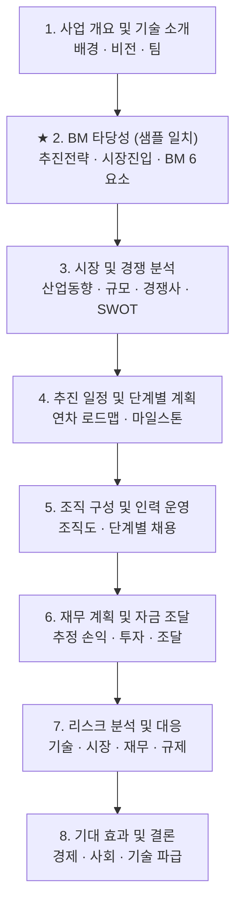

# 사업계획서 작성 플랜 (화공산 학교수업)

## Context
- **대상**: 화공산 학교수업 사업계획서. 양식.png는 이전에 작성한 모범 사업계획서의 4쪽(섹션 "2. BM 타당성")으로, 새 계획서의 **형식·문체·위계 레퍼런스**.
- **주제 가정**: 샘플과 동일 도메인(유기나노소재 및 이를 활용한 광전소자 — OLED·태양전지·광센서). 다른 화공 아이템으로 바꾸려면 §"섹션별 작성 가이드"의 예시 키워드만 치환하면 동일 골격이 그대로 사용 가능.
- **목표 산출물**:
  1. **`Plan.md`** (양식.png와 동일 경로: `C:\Users\filk2\Desktop\공부자료\학교수업\화공산\Plan.md`) — 본 플랜 문서를 그대로 저장.
  2. (이후 단계) Plan.md를 따라 작성될 본 사업계획서 한글(.hwp) 또는 워드 문서.
- **본 단계의 범위**: Plan.md 저장까지. 사업계획서 본문 집필은 승인 후 별도 진행.

---

## 1. 양식.png 분석 — 형식·문체 사양

### 1-1. 위계(3단) 구조
```
[Lv1] "2. BM 타당성"                      ← 아라비아 숫자 + ". " + 명사형 대제목
  [Lv2] "-신제품 및 서비스 추진전략과 …"   ← 대시(-) 직후 공백 없이 중제목
    [Lv3] "1. 고객 세분화 및 타겟팅: …"    ← "숫자. 키워드: 설명문." 형태
```
- Lv1: 굵게, 한 줄.
- Lv2: 일반(혹은 약간 굵게), 한 줄, 그 아래 단락형 본문.
- Lv3: 동일 행에 "키워드: 본문" 형태로 1~3문장 서술.

### 1-2. 문체
- 격식체·단정형 종결어미: "…한다 / …된다 / …이다 / …할 것이다".
- 1인칭 사용 없음. "본 사업", "본 제품" 등 객체 지칭.
- 한 문장 평균 60~90자, 단락 3~6문장.

### 1-3. 페이지 포맷
- 하단 중앙 페이지번호 `- N -`.
- 본문은 단(段) 없는 단단(single-column) 한글 문서.
- 표·그림은 본문 흐름 사이에 배치하고 "<표 1>", "<그림 1>" 캡션 권장.

---

## 2. 전체 목차 (제안)

샘플의 "2. BM 타당성"이 #2이므로 **#1은 사업 개요/기술 소개**로 배치하고, 그 뒤로 표준 사업계획서 구성을 잇는다.



총 분량 가이드: **본문 25~30쪽** (표지·목차·부록 별도). 학교 과제 표준치.

---

## 3. 섹션별 작성 가이드

각 섹션은 **양식의 3단 위계**(번호 대제목 → 대시 중제목 → 숫자 세부항목)를 동일하게 적용한다.

### 1. 사업 개요 및 기술 소개  (3~4쪽)
- **-사업 추진 배경 및 필요성**: 시장 페인포인트(예: 차세대 디스플레이·태양전지의 효율 한계, 기존 무기소재의 고가·환경부담), 정책·산업 트렌드.
- **-사업 비전과 미션**: 한 문장 비전, 3년/5년 중장기 목표(매출·점유율·기술수준).
- **-제품/기술 개요**: 유기나노소재의 핵심 물성(고이동도·광흡수·합성 용이성 등)과 이를 적용한 광전소자(OLED, 태양전지, 광센서)의 컨셉. 1~2개의 모식도/구조도 권장.
- **-팀 구성 요약**: 대표·연구·생산·마케팅 책임자 1줄 프로필, 학교과제는 팀원별 역할로 대체 가능.

### 2. BM 타당성  (4~5쪽) — **샘플과 동일 형식 유지**
- **-신제품 및 서비스 추진전략과 사업화 계획**: 도입~확산 단계별 전략 단락(2~3문단). *샘플 본문 그대로 재사용 가능.*
- **-BM 구체화 및 시장 진입 전략**: ① 사전기획 단계 → ② 시장진입 단계 → ③ 양산·글로벌 단계의 3단계 진행. *샘플 그대로 유지.*
- **-구체적인 비즈니스 모델**: 다음 6개 항목을 "숫자. 키워드: 설명." 패턴으로 작성 (샘플 그대로):
  1. 고객 세분화 및 타겟팅
  2. 가격 책정 전략
  3. 판매 채널 구축
  4. 인력 확보 및 조직 구성
  5. 효율적인 유통망 구축
  6. 마케팅 및 홍보 전략

### 3. 시장 및 경쟁 분석  (4쪽)
- **-국내외 산업 동향**: 유기소재·광전소자 시장 동향(연 성장률, 주요 응용처).
- **-시장 규모 및 성장성**: TAM/SAM/SOM 표 1개. 출처(시장조사기관·논문) 각주.
- **-경쟁사 및 경쟁 기술 분석**: 비교표 (당사 vs 주요 경쟁 3사: 성능지표·가격·강약점).
- **-SWOT 분석**: 2×2 표.

### 4. 추진 일정 및 단계별 계획  (2~3쪽)
- **-단계별 로드맵**: 1차연도(R&D·특허) → 2차연도(시제품·파일럿 양산) → 3차연도(양산·글로벌). 간트 차트 1개 필수.
- **-주요 마일스톤**: 분기별 KPI 표(특허건수·시제품 수율·매출).

### 5. 조직 구성 및 인력 운영 계획  (2쪽)
- **-조직도**: 박스형 조직도 1개.
- **-단계별 인력 확보 계획**: 연차별 인원 표(직무·인원·자격요건).
- **-역량 강화 방안**: 산학협력·외부전문가 자문·교육.

### 6. 재무 계획 및 자금 조달  (3~4쪽)
- **-매출 및 손익 추정**: 3개년 추정 손익계산서 표(매출·원가·판관비·영업이익).
- **-투자 계획**: R&D·설비·운영자금 항목별 표.
- **-자금 조달 방안**: 자기자본·정부지원사업(예: 창업성장기술개발·소부장)·VC 라운드 단계 표기.

### 7. 리스크 분석 및 대응 방안  (1~2쪽)
- **-기술 리스크 / -시장 리스크 / -재무 리스크 / -규제 리스크** 4개 중제목.
- 각 중제목 하단에 "리스크: 대응방안" 형태 1~2개 항목.

### 8. 기대 효과 및 결론  (1~2쪽)
- **-경제적 효과**: 매출·고용창출·수입대체.
- **-사회적·환경적 효과**: 친환경 소재·에너지 효율 기여.
- **-기술적 파급 효과**: 후속 응용 분야(웨어러블·바이오센서 등).
- **-결론**: 5~7줄 정리, 핵심 메시지.

---

## 4. 작성 순서 (집필 우선순위)

1. **2장(BM 타당성)** — 샘플이 이미 있으므로 그대로 옮기고 다듬기 (가장 빠른 출발).
2. **1장(사업 개요)** — 주제·비전을 확정하면 다른 장들이 정렬됨.
3. **3장(시장 분석)** — 외부 자료 조사 시간 필요, 빨리 시작.
4. **4·5장(일정·조직)** — 1·3장 확정 후 일관되게 작성.
5. **6장(재무)** — 4장 일정과 맞물리므로 4장 다음.
6. **7·8장(리스크·결론)** — 마지막에 통합 관점에서 작성.

---

## 5. 산출물 저장 (실행 단계)

1. 본 플랜 문서를 사용자 로컬 경로 `C:\Users\filk2\Desktop\공부자료\학교수업\화공산\Plan.md` 에 저장한다.
2. 같은 디렉터리의 `양식.png`, `학습교육자료.hwp` 는 손대지 않는다.
3. 추가 요청 시 Plan.md를 토대로 각 장의 본문을 차례로 집필한다 (기본 산출물 형식: 한글 .hwp 또는 .docx, 사용자 선택).

---

## 6. Verification (작성 후 자가 점검)

- [ ] 모든 장이 **3단 위계**(번호 → 대시 → 숫자)를 따르는가
- [ ] 모든 문장이 **격식 단정형**("…한다") 종결인가
- [ ] Lv3 항목이 **"키워드: 설명"** 패턴을 지키는가
- [ ] 시장 규모·매출 목표 등 **수치는 출처 각주** 표기됐는가
- [ ] 각 장에 **표/그림 1개 이상** 삽입됐는가 (1·3·4·5·6장은 필수)
- [ ] 페이지 하단 `- N -` 페이지번호 통일
- [ ] 총 분량 25~30쪽 (±10%)
- [ ] 샘플(2장)과 신규 작성 부분의 **문체·용어 일관성** 확인 (예: "유기나노소재", "광전소자" 표기 통일)