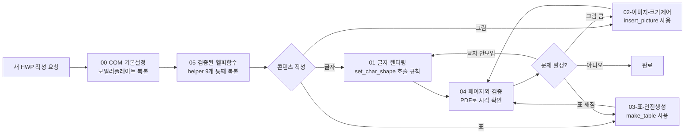

# HWP 자동생성 가이드북

Hancom Office HWP 파일을 Python `win32com` COM Automation으로 만들 때 매번 반복되는 함정과 그 해결책을 정리한 자가완결 문서 묶음. 다음에 HWP를 만들 때는 **이 폴더만** 참고하면 된다.

---

## 전제 환경

- **Windows + Hancom Office (한글)** 설치 필수. `HWPFrame.HwpObject` COM 컴포넌트가 등록되어 있어야 함.
- Python 패키지: `pywin32` (필수), `Pillow` (이미지 크기 자동 계산용).
- 폰트: 기본은 **함초롬바탕**. Hancom Office 설치 시 같이 깔리지만 시스템에 없으면 글자가 비어 출력됨 — `set_char_shape(face=...)`로 다른 폰트 지정 가능.

---

## 작업 흐름

---

## 증상 → 문서 매핑

| 증상 | 진짜 원인 | 가야 할 문서 |
|---|---|---|
| 텍스트가 통째로 안 보임 / 빈 페이지 | `CharShape`의 7개 언어 서브셋(Hangul/Latin/Hanja/Japanese/Other/Symbol/User)에 `FontType=1`(TTF)·`FaceName`·`Ratio=Size=100`이 안 들어감 | [01-글자-렌더링.md](./01-글자-렌더링.md) |
| 단락마다 글자 크기·서체가 들쭉날쭉 | 매 write 직전에 `set_char_shape`을 다시 안 부름 → 이전 액션 속성이 잔류 | [01-글자-렌더링.md](./01-글자-렌더링.md) |
| 그림이 한 페이지를 통째로 차지 / 잘림 | `InsertPicture`가 원본 픽셀 크기로 들어감. 후처리로 컨트롤 크기를 강제해야 함 | [02-이미지-크기제어.md](./02-이미지-크기제어.md) |
| 표가 글자만 정렬 안 된 채 나열됨 | 진짜 표(`TableCreate`)가 아니라 `\|`로 흉내 낸 텍스트를 썼음 | [03-표-안전생성.md](./03-표-안전생성.md) |
| 두 번째 표 만들 때 COM 오류 | `HParameterSet.HTableCreation` 싱글턴 재사용 충돌. `CreateAction`+`CreateSet`으로 매번 새로 생성해야 함 | [03-표-안전생성.md](./03-표-안전생성.md) |
| 표 다음에 쓴 글자가 셀 안에 들어감 | 표 만든 후 셀 안에 커서가 갇힘. `SetPos(저장위치)`→`MoveLineEnd`→`BreakPara`로 빠져나와야 함 | [03-표-안전생성.md](./03-표-안전생성.md) |
| 페이지 번호가 안 찍힘 / `1`만 찍힘 | `PageNumPos`로 `Pos=8`(중앙 하단), `SideChar=1`(`- N -` 양옆 대시) 명시 필요 | [04-페이지와-검증.md](./04-페이지와-검증.md) |
| 만들어진 결과를 시각 확인하기 어려움 | `FileSaveAsPdf` 액션으로 PDF 변환 후 눈으로 확인 | [04-페이지와-검증.md](./04-페이지와-검증.md) |

---

## 5단계 체크리스트 (다음 HWP 만들 때 따라가기)

1. **[00-COM-기본설정.md](./00-COM-기본설정.md)** — `EnsureDispatch`, `RegisterModule`, `SetMessageBoxMode`, `Visible=False`, `FileNew` 보일러플레이트를 복사. 마지막에 `SaveAs` + `Quit`까지 짝 맞춤.
2. **[05-검증된-헬퍼함수.md](./05-검증된-헬퍼함수.md)** — 9개 helper(`set_char_shape`, `set_para_shape`, `insert_text`, `br`, `page_break`, `write_line`, `write_para`, `insert_picture`, `make_table`)를 통째로 복사. **새로 짜지 말 것.**
3. 본문 작성: 단락은 `write_line` / `write_para`, 그림은 `insert_picture`, 표는 `make_table`. 직접 `HAction.Run` 호출하기 전에 helper로 처리 가능한지 먼저 확인.
4. 페이지 번호와 페이지 나눔은 [04-페이지와-검증.md](./04-페이지와-검증.md)의 패턴대로.
5. 저장 후 같은 스크립트에서 PDF 변환을 돌리고 **첫 페이지·표 페이지·그림 페이지를 눈으로 확인**. 글자 크기 잔류 의심되면 사후 검증 루틴(04 문서)도 돌릴 것.

---

## 절대 다시 안 하는 3가지 (★ 핵심 함정)

1. **`CharShape`을 부분만 세팅 (예: `Height`만 바꾸기)** → 7서브셋 전부 + `FontType=1`·`Ratio=Size=100` 같이 세팅. → [01](./01-글자-렌더링.md)
2. **`InsertPicture` 후 크기 검증 안 하기** → 항상 `HeadCtrl` 순회로 `gso` 컨트롤 찾아 `Properties.SetItem("Width"/"Height")` 강제. 130mm 높이 캡 적용. → [02](./02-이미지-크기제어.md)
3. **여러 표 만들면서 같은 `HParameterSet` 재사용** → 매 호출마다 `hwp.CreateAction("TableCreate")` + `act.CreateSet()`. → [03](./03-표-안전생성.md)
